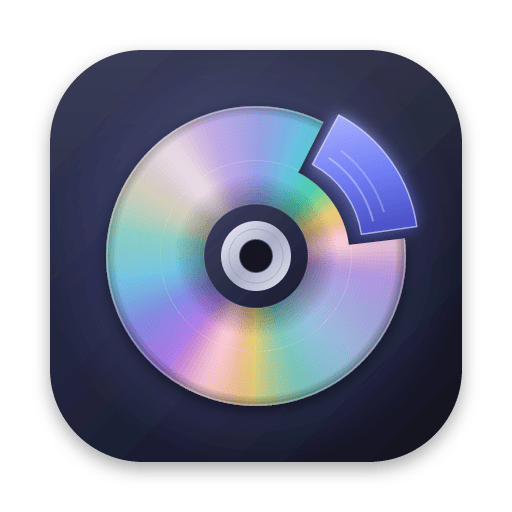
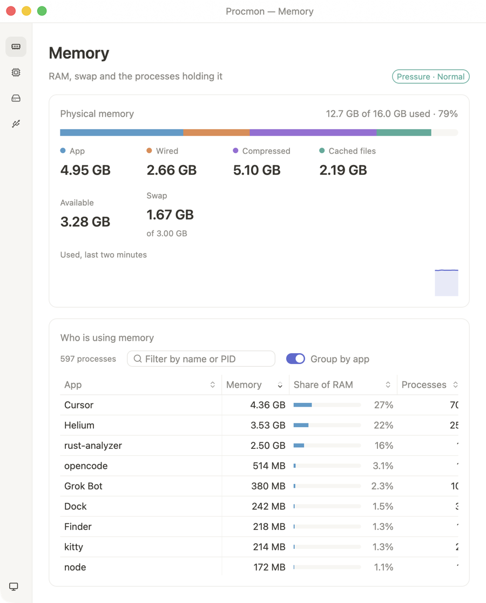
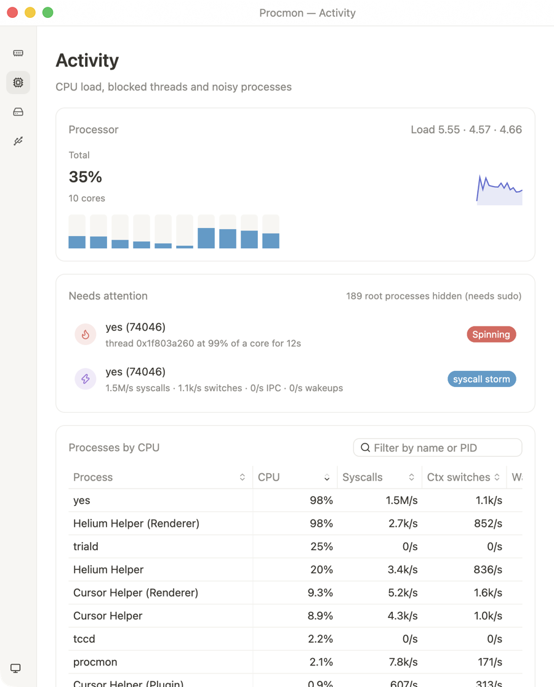
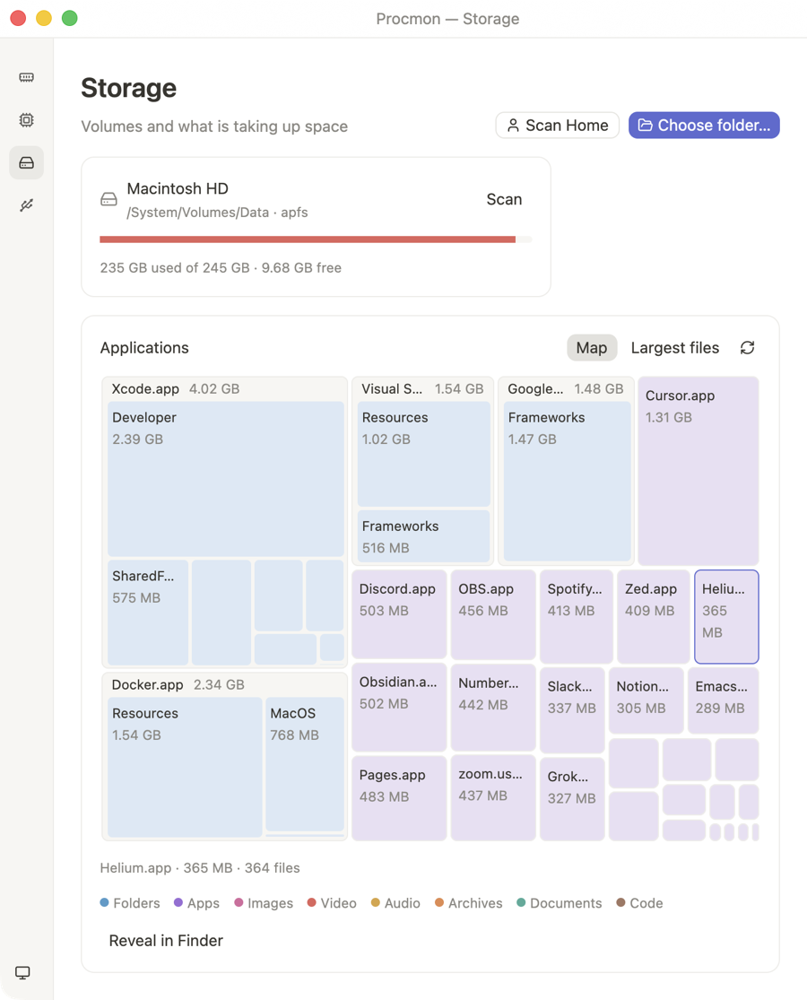
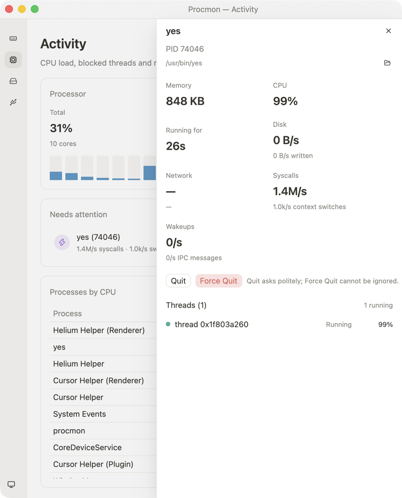

<p align="center"></p>

# Procmon

A small, native system monitor for macOS, built in Rust with [GPUI](https://github.com/zed-industries/zed) (Zed's GPU UI framework) and [GPUI Kit](https://gpui-kit.com) components. The whole app downloads as a ~3 MB DMG.

<p align="center"></p>

It answers four questions quickly:

- **Memory:** where is my RAM going, and which apps are holding it?
- **Activity:** is anything stuck, spinning, or hammering the kernel or network?
- **Storage:** what is taking up space on disk? (Disk Drill-style boxes you can click into.)
- **Devices:** what hardware is connected, and are its drivers actually running?

<p align="center"> </p>
<p align="center"> </p>

## Features

### Memory
- Activity Monitor–style breakdown of physical memory: app, wired, compressed and cached files, plus swap and the kernel's memory-pressure level.
- Usage history for the last two minutes.
- "Who is using memory": per-app totals (helper processes roll up into the `.app` that owns them) or per-process rows, sortable and searchable.

### Activity
- Total and per-core CPU load, load averages and history.
- **Needs attention** flags, without false alarms from a single unlucky sample:
  - **Blocked** threads stuck in an uninterruptible kernel wait for 3 s or more.
  - **Stopped** threads (suspended by a debugger or `SIGSTOP`).
  - **Spinning** threads pegging a core for 10 s or more.
  - Processes **flooding the kernel or network**: syscall storms, context-switch thrash, IPC floods, frequent wakeups, page-fault storms, packet floods.
- Per-process syscalls/s, context switches/s, wakeups/s, disk and network throughput.
- Double-click a process (or right-click → Inspect) for a detail sheet with every thread's live run state, the executable path, and **Quit** / **Force Quit** (with confirmation).

### Storage
- Volumes with usage meters.
- Fast parallel scan of any folder, drawn as a **squarified treemap**. Big folders show their contents as nested boxes, so you can see what is inside before clicking in. Colours follow file type.
- Breadcrumbs, up, rescan, and hover for size and file count.
- **Largest files** view across the whole scan.
- Reveal in Finder and **Move to Trash** (via Finder's Trash, so items can be put back).

### Devices
- USB, Thunderbolt/USB4, Bluetooth (connected and paired), displays and GPU, audio, cameras, network interfaces and physical drives with SMART status.
- Loaded kernel extensions, system extensions and DriverKit drivers with their state. Drivers waiting for approval in System Settings, faulty devices and failing drives are surfaced under **Needs attention**.

### App
- Light and dark themes (warm, Notion-like neutrals with a soft indigo accent) that follow the system or can be picked from the sidebar.
- Scales with the window: layouts wrap, and the sidebar collapses to icons below 900 px.
- Settings (theme, group-by-app) persist in `~/Library/Application Support/Procmon/settings.json`.

## Install

Download the latest build from [Releases](https://github.com/Yuvraj-cyborg/procmon/releases):

- **macOS:** `Procmon-<version>-macos-arm64.dmg` (Apple silicon) or `…-x86_64.dmg` (Intel). Open it and drag Procmon into Applications.
- **Linux:** `procmon-<version>-linux-<arch>.tar.gz` (run `./install.sh` inside it), or the `.deb` for Debian/Ubuntu.

## Build from source

With [Nix](https://nixos.org) (flakes enabled), everything is pinned:

```sh
nix develop          # Rust 1.98.1, node, resvg, pngquant, oxipng, cargo-bloat
make install         # build, bundle and copy Procmon.app into /Applications
nix build            # or build the package itself (result/Applications/Procmon.app)
```

Without Nix you need Rust (the version in `rust-toolchain.toml` is picked up automatically by rustup) and, on macOS, the Xcode command-line tools.

| Command | Result |
| --- | --- |
| `make run` | Debug build, launched |
| `make build` | Size-optimised release binary in `target/<triple>/release/` |
| `make app` | `dist/Procmon.app` (ad-hoc signed; set `SIGN_IDENTITY` to use a Developer ID) |
| `make install` | Copies `Procmon.app` into `/Applications` |
| `make dmg` | `dist/Procmon-<version>-macos-<arch>.dmg` |
| `make linux` | `dist/procmon-<version>-linux-<arch>.tar.gz` |
| `make icon` | Regenerates the icon from `scripts/icon/generate.mjs` |

### Binary size

Release builds are tuned for size: `opt-level = "z"`, fat LTO, one codegen unit, `panic = "abort"` and stripped symbols (25.3 MB → 7.4 MB). With rustup available, `scripts/build-release.sh` goes further using a pinned nightly to rebuild `std` for size (immediate-abort panics, no panic location strings, std's size-optimised paths), bringing the macOS binary to about 6.2 MB. The DMG compresses that to ~3 MB. Nearly all of what remains is GPUI and its component library, so this is close to the floor for a GPUI app.

### Command-line options

```text
procmon [OPTIONS]
  --page <name>    Open on a page: memory, activity, storage or devices
  --scan <path>    Open Storage and start scanning <path>
  --inspect <pid>  Open the detail sheet for a process
  -h, --help       Print help
```

### Keyboard shortcuts

| Shortcut | Action |
| --- | --- |
| ⌘1 – ⌘4 | Memory, Activity, Storage, Devices |
| ⌘F | Focus the process filter |
| ⌘R | Rescan storage / refresh devices |
| ⌘\\ | Toggle the sidebar |
| ⌘W / ⌘Q | Close / quit |

## Permissions

- **Root-owned processes** can't be inspected by a normal user. Their thread states and kernel counters are hidden, and the Activity page shows how many were skipped. Run with `sudo` to include them.
- **Protected folders** (Mail, Messages, parts of `~/Library`, …) are skipped during scans unless Procmon (or the terminal that launched it) has **Full Disk Access**. The Storage page reports how many folders were skipped.
- Quit/Force Quit only work on processes you own (or anything, under `sudo`). Procmon refuses to signal PID 0/1 or itself.

## How it works

| What | Source |
| --- | --- |
| Memory breakdown | `host_statistics64` (`vm_statistics64`): app = internal − purgeable pages |
| Memory pressure | `kern.memorystatus_vm_pressure_level` |
| Per-process memory | `proc_pid_rusage` physical footprint (what Activity Monitor shows), falling back to RSS |
| Thread states | `proc_pidinfo(PROC_PIDTHREADINFO)` run state and CPU usage |
| Kernel activity | Deltas of `proc_pidinfo(PROC_PIDTASKALLINFO)` syscall, context-switch, Mach message and fault counters, plus idle wakeups from rusage |
| Network per process | `nettop` one-shot CSV, parsed by column name |
| CPU, processes, disks | [`sysinfo`](https://crates.io/crates/sysinfo) |
| Devices | `system_profiler -json`, `kmutil showloaded`, `systemextensionsctl list` |
| Disk usage | Parallel scan ([`rayon`](https://crates.io/crates/rayon)) of allocated blocks; stays on one filesystem, skips symlinks, counts hard links once |

Sampling runs off the UI thread once per second; thread states are probed every 2 s and network every 3 s to keep Procmon's own overhead around 2% CPU.

### Layout

```text
src/
  main.rs, app.rs      window, sidebar shell, page routing
  actions.rs, cli.rs   menu bar, shortcuts, command-line options
  settings.rs, theme.rs
  units.rs             strongly-typed Bytes, Ratio, Percent, Rate, Pid, …
  system/              sampler, macOS probes, snapshots, process control
  storage/             scanner, file tree arena, squarified treemap, trash
  devices/             device and driver inventory
  ui/                  pages, tables, detail sheet, widgets
scripts/               release build, macOS bundle/DMG, Linux packaging, icon, CI helpers
packaging/             Info.plist template, Linux desktop entry and installer
flake.nix              pinned toolchain, dev shell and package
```

## Platform support

Procmon is built for macOS first. Linux x86_64 and aarch64 builds are produced by CI; there, memory, CPU, processes and disk scans work through `sysinfo`, while thread states, kernel counters, per-process network, the device inventory and Trash are macOS-only for now. Windows builds are planned; the disk scanner and process control still need Windows implementations.

## Releases and signing

Pushing a tag like `v0.1.0` runs `.github/workflows/release.yml`, which builds all four targets and publishes a GitHub release with SHA-256 checksums. It can also be started by hand from the Actions tab to test packaging without publishing.

macOS DMGs are signed with a Developer ID and notarized when these repository secrets exist, and ad-hoc signed otherwise:

| Secret | Contents |
| --- | --- |
| `APPLE_CERTIFICATE_P12` | Base64 of your exported "Developer ID Application" certificate (.p12) |
| `APPLE_CERTIFICATE_PASSWORD` | The password chosen when exporting it |
| `APPLE_SIGNING_IDENTITY` | Optional; defaults to the first Developer ID in the certificate |
| `APPLE_API_KEY_P8`, `APPLE_API_KEY_ID`, `APPLE_API_ISSUER_ID` | App Store Connect API key for notarization (recommended) |
| `APPLE_ID`, `APPLE_TEAM_ID`, `APPLE_APP_PASSWORD` | Or: Apple ID with an app-specific password |

`scripts/ci/set-github-secrets.sh path/to/certificate.p12` sets them for you with the GitHub CLI.

## Tests

```sh
cargo test
```

Live checks that read the real system are marked `#[ignore]` and can be run explicitly, for example:

```sh
cargo test --release sampler_live -- --ignored --nocapture
SCAN_ROOT=$HOME cargo test --release scan_live -- --ignored --nocapture
```
