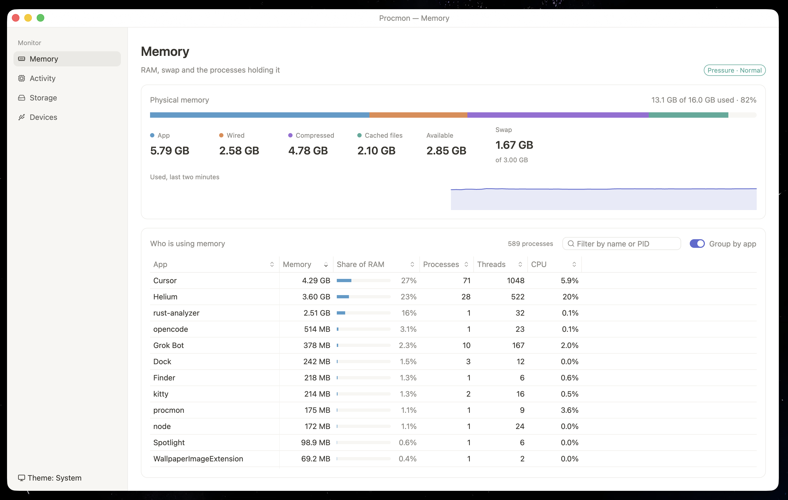

# Procmon

A small system monitor. On macOS it is a native Swift app, and the download is about half a megabyte. On Linux and Windows it is written in Rust with [GPUI](https://github.com/zed-industries/zed).

<p align="center"></p>

## What it shows

- **Overview:** everything below, on one screen.
- **Memory:** how much RAM is in use, and which apps are using it.
- **Activity:** CPU use, and any process that is stuck, spinning, or sending too many requests.
- **Storage:** what is filling your disk, shown as boxes you can click into.
- **Devices:** connected hardware, and whether its drivers are running.

## Install

Get the latest version from [Releases](https://github.com/Yuvraj-cyborg/procmon/releases).

- **macOS 15 or later:** open the `.dmg` and drag Procmon into Applications.
- **Linux:** unpack the `.tar.gz` and run `./install.sh`, or install the `.deb`.
- **Windows:** unzip it and run `procmon.exe`.

## Build

The macOS app is in `macos/` and needs Xcode 26. The Linux and Windows app is the Rust code in the main folder. If you use [Nix](https://nixos.org), run `nix develop` first to get the exact Rust tools.

```sh
make run       # start a debug build
make test      # run the tests
make install   # macOS: build Procmon.app and copy it to /Applications
make dmg       # macOS: build a .dmg in dist/
make linux     # Linux: build a .tar.gz in dist/
```

## Shortcuts on macOS

| Keys | Action |
| --- | --- |
| ⌘1 – ⌘5 | Switch page |
| ⌘F | Search processes |
| ⌘R | Rescan or refresh |

## Good to know

- Some processes belong to the system. Run Procmon with `sudo` to see their full details.
- Folders like Mail and Messages are skipped during a scan unless Procmon has Full Disk Access.
- On Linux and Windows, memory, CPU, processes and disk scans work. The rest is macOS only for now.
